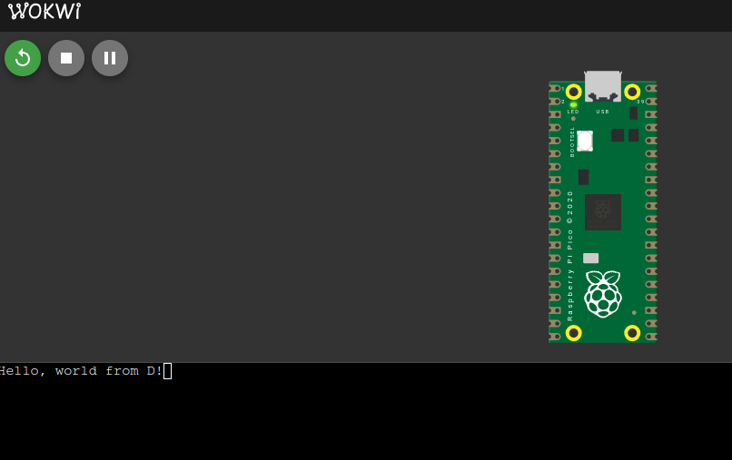

# rp2040-dlang

Use D programming language in Raspberry Pi Pico and other RP2040 boards

## Requirements

- [Raspberry Pi Pico SDK](https://github.com/raspberrypi/pico-sdk)
- [ARM GCC toolchain](https://developer.arm.com/downloads/-/arm-gnu-toolchain-downloads) - for `rp2040` & `rp2350-arm-s` platforms
- [pico-sdk-tools/riscv-toolchain](https://github.com/raspberrypi/pico-sdk-tools/releases) - for `rp2350-riscv` platform
- [D compiler](https://dlang.org/download.html) - preferred **GDC** or **LDC2**
- [CMake](https://cmake.org/download/)

## How to build

```bash
git clone --recursive https://github.com/raspberrypi/pico-sdk.git
export PICO_SDK_PATH=$PWD/pico-sdk
export PICO_PLATFORM=rp2040
export PICO_TOOLCHAIN_PATH=/path/gcc-arm-none-eabi-(version) # or add it to PATH

export DC=gdc
# or
export DC=ldc2
```

```bash
git clone https://github.com/kassane/rp2040-dlang.git
cd rp2040-dlang
cmake -B build # optional -DBETTERC=ON
cmake --build build
```

[Wokwi preview - running blinkly from RP2040-dlang](https://wokwi.com/experimental/viewer?diagram=https%3A%2F%2Fraw.githubusercontent.com%2Fkassane%2Frp2040-dlang%2Frefs%2Fheads%2Fmain%2Fdiagram.json&firmware=https%3A%2F%2Fgithub.com%2Fkassane%2Frp2040-dlang%2Freleases%2Fdownload%2Fv1.0.0%2Fd-blinky-rp2040.uf2)
